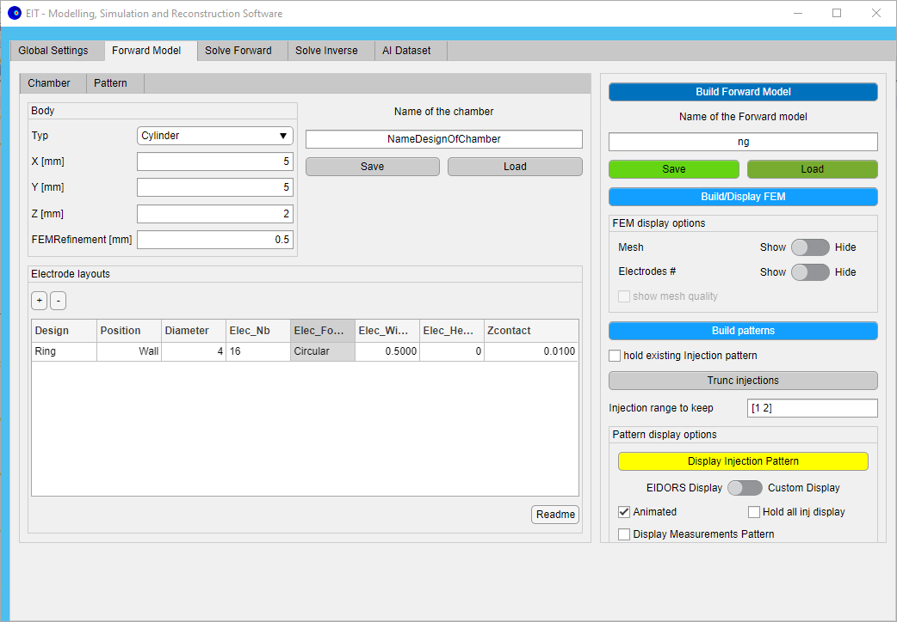
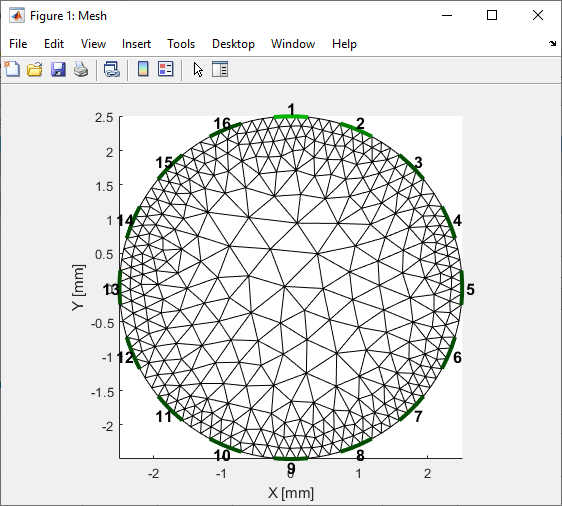
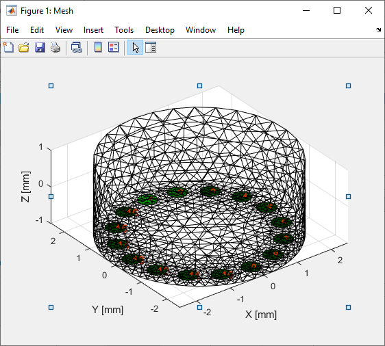
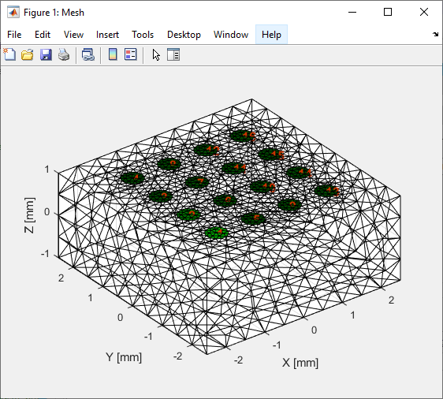
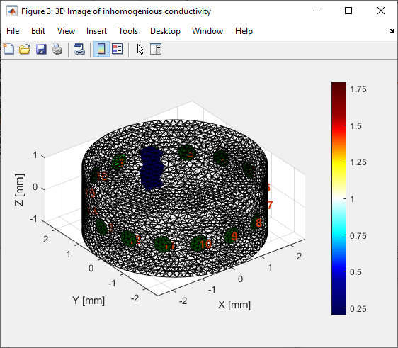

# **App_EIDORS_ModelSim**

Thank you for the interest in `App_EIDORS_ModelSim`!

`App_EIDORS_ModelSim` is a MATLAB-based, open-source framework for Modeling, Simulation and Reconstruction of Electrical Impedance Tomography (EIT) setup.

# **1. Introduction**

## **1.1 Depedencies**

This MATLAB-based app is based on the toolbox [EIDORS](http://eidors3d.sourceforge.net/)

You will need:

- Matlab (only R2021a tested)
- EIDORS ([eidors-v3.10-ng](http://prdownloads.sourceforge.net/eidors3d/eidors-v3.10-ng.zip))

## **1.2 Features**

This App implements the main functionality that the EIDORS Toolbox offers:

- [x]  Generation Forward model
    - [x]  Setting of the forward solver
    - [x]  Generation of measurement chamber: 2D (circle) and 3D (cylinder/cubic) using netgen
    - [x]  Generation of electrodes layout: ring and array (only for 3D on top or bottom surface)
    - [x]  Generation of injection and measurements pattern
- [x]  Simulation of measurements
    - [x]  Setting of the conductivity by adding objects (cells, sphere, cylinder) in the chamber
    - [x]  Solving of the forward problem
- [x]  Reconstruction of measurements
    - [x]  Setting of the inverse solver
    - [x]  Loading real measurement or use of simulation results for the reconstruction
    - [x]  Solving of the inverse problem
- [x]  Plotting
    - [x]  FEM mesh of the forward model
    - [x]  Pattern
    - [x]  Simulation results (FEM/ measurements Uplots)
- [x]  Generation of dataset for AI
    - [x]  Generation of Simulation of measurements
    - [x]  Samples data extraction for python-based AI computation

## **1.2 Installation**

This MATLAB-based framework is based on the toolbox [EIDORS](http://eidors3d.sourceforge.net/).

### **Windows**

Steps:

- Install MATLAB (only R2021a tested)
- Download EIDORS ([eidors-v3.10-ng](http://prdownloads.sourceforge.net/eidors3d/eidors-v3.10-ng.zip))  and save the `EIDORS`-folder on your local machine under `C:` such as the `startup.m`-file is at the path: 'C:\EIDORS\eidors\startup.m (note: you can also put it somewhere else, in that case you will be asked after the first start of the app)
- Start the App (see 1.3 Starting the App in MATLAB)

### **Linux (Ubuntu 20.04.3 LTS 64-bit)**

Steps:

- Install MATLAB (only R2021a tested)
- Download EIDORS ([eidors-v3.10-ng](http://prdownloads.sourceforge.net/eidors3d/eidors-v3.10-ng.zip))  and save the `EIDORS`-folder on your local machine under `/usr/local/` such as the `startup.m`-file is located at the path: '/usr/local/EIDORS/eidors/startup.m` (note: you can also put it somewhere else, in that case you will be asked after the first start of the app)
- Install netgen-5.3.1 (see documentation under doc/netgen_UNIX_installation), good luck 😉!!
- Start the App (see 1.3 Starting the App in MATLAB)

### **MacOS(Monterey 12.4)**

Steps:

- Install MATLAB (only R2021b tested)
- Download EIDORS ([eidors-v3.10-ng](http://prdownloads.sourceforge.net/eidors3d/eidors-v3.10-ng.zip))  and save the `EIDORS`-folder on your local machine such as the `startup.m`-file is located at the path: '/Users/user/Documents/EIDORS/eidors/startup.m`, you will be asked after the first start of the app
- Build latest netgen from source(see more information on https://ngsolve.org/forum/ngspy-forum/1257-apple-silicon), 
- Start the App (see 1.3 Starting the App in MATLAB)
- Since netgen is installed in `Applications` folder on Mac, the netgen path will be asked when start the App and the path `/Applications/Netgen.app/Contents/MacOS/netgen`should be entered manually.

# **2. Starting the App in MATLAB**

Run the script 'start.m' 

```matlab
>> cd Path\To\App_EIDORS_ModelSim
>> start 
```
<br>
*App start page*

During the start of the app EIDORS-Toolbox will be started (will be loaded in the MATLAB-PATH)


# **3. Use of the App**

The App is divided in 5 :
- Global Settings <br>
-> Save/Load EIT environement, Select units, ...
- Forward Model <br>
-> Define fwd solver, chamber, electrodes, patterns to build the Forward Model or fmdl
- Solve Forward <br>
-> Simulate measurements using the fmdl by setting some object in the chamber
- Solve Inverse <br>
-> EIT Image Reconstruction using the fmdl and Simualtions data or measurements data 
- AI Dataset <br>
-> Simulate measurements using the fmdl and ramdom generation of  to build a  dataset for AI training

## **3.1. Global Settings**

here on the first page you can
- check the used EIDORS-toolbox path
- Choose the units you want to use
- Save/Load the eit environnement (eit_env) to save/load your work

the "export 2py" option allow to save additionaly the `eit_env` as a python-compatible-mat-file which can be read by python (scipy) for the [`eit_app`](https://github.com/DavidMetzIMT/eit_app) and [`eit_model`](https://github.com/DavidMetzIMT/eit_model), see also "/file/mat_utils.py" in [`glob_utils`](https://github.com/DavidMetzIMT/glob_utils)) for the loading of scuh file in python.

<br>
*App page: Global Settings*

## **3.2. Forward Model**

The forward model can be in one click build. During that build the FEM and the patterns are generated using the data entries selected in the `Chamber` and the `Pattern`-tabs.

It is also possible to generate/ajust the FEM and the patterns manually. ATTENTION: 
the rebuild of the FEM will reset the patterns, so make sure to rebuild them afterwards.

The build Forward model can be saved and loaded back.

Mulptiple FEM and Pattren diplay options are valible to allow optimal investigations of those (see below).


<br>
*App page: Forward Model*

Notes:
- Before building the forward model, make sure you set the units you need.

### **3.2.2 Chamber for FEM**

To build the FEM,  the EIT Chamber, which is composed out of a body (volume, centered in (0,0,0)) and electrode layouts, need to be defined. The FEM will be computed with netgen using the refinement value for the meshing.

The Chamber can be separately saved and loaded. 

Multiples bodies are available :
- 2D Circle
- 3D Cylinder (oriented on the Z-axis)
- 3D Cubic

Multiples electrode layout designs are available:
- Ring
- Array

Those can be placed at different position in the chamber (wall, top, bottom), and their diameter can be varied.

For each design an electrode numbers, form (point, circle, rectangle), size(width (diameter), height) and zcontact can be selected.

<br>
*App page: Forward Model - Chamber*

Below are the compatible combination between body, electrode layout designs and electrode layout position.
|Body|Electrode Layout Design|Electrode Layout Position|FEM plot|
|:---:|:---:|:---:|:---:|
|2D Circle|Ring| Wall||
|3D Cylinder|Ring| Wall||
|3D Cylinder|Ring| Top||
|3D Cylinder|Ring| Bottom||
|3D Cylinder|Array*| Top||
|3D Cylinder|Array*| Bottom||
|3D Cubic|Ring| Top||
|3D Cubic|Ring| Bottom||
|3D Cubic|Array*| Top||
|3D Cubic|Array*| Bottom||

It also possible to select multiple layouts design in the same chamber.

|Chamber example|Layouts|FEM plot|
|:---:|:---:|:---:|
|3D Cylinder| Ring Top <br> Array Bottom||
| 3D Cubic| Ring Top <br> Array Bottom| |
| ..| ...| ...|

When 2D is selected, the electrode position should be always on wall.

### **3.2.3 Pattern**

To build the injection and measuremnet pattern select:
- the amplitude of the injection current
- the generating function (same for inj. and meas. patterning)
- the options of the generating function
- the injection pattern and ia the user pattern
- the measurements pattern and ia the user pattern


After a first build it is possible to append new patterns by selecting the hold options before rebuilding them

After building the patterns, the injections can be trunced by selecting the range of the injections to keep.


<br>
*App page: Forward Model - Patterns*

The injection pattern can be displayed using the EIDORS function "show_stim_meas_pattern" or a lightweight display custom function. Each measurements pattern can be displayed by selectioon the corresponding Injection Nr.

Example of patterning display

| Inj Pattern | Meas Pattern | Show Measurements | EIDORS Display | Custom Display |
|:---:|:---:|:---:|:---:|:---:|
|ad | ad|OFF|  |  |
|ad | ad|ON|  |  |
|op | op|OFF|||
|op | op|ON|||

## **3.3. Solve Forward**

To solve the forward problem:
- Set the EIDORS solving parameters
- Set the conductivity of the chamber by setting the conductivity of the medium in the chamber, and by adding objects/artefact (sphere, cell, cylinder) with a different conductivity.

 <br>
*App page: Solve Forward/Simulation*

During the simulation the homogenious and inhomogenious images and data (simulated measurements) are generated and computed:

| Homogenous image | Inhomogenous image  | Simulated data/measurements | 
|:---:|:---:|:---:|
| | | |

The results of the simulation can be saved and relaoded.

With following command you can directly access the variables of forward model.
```matlab
>> app.eit_env.fwd_model.fmdl()   % struct of forward model for EIDORS
>> app.eit_env.sim.img_h          % homogeneous EIDORS FEM image
>> app.eit_env.sim.img_ih         % inhomogeneous EIDORS FEM image
>> app.eit_env.sim.data_h         % homogeneous EIDORS data
>> app.eit_env.sim.data_ih        % inhomogeneous EIDORS data
```

Three object types are available:
- Sphere/Cell 
- Cylinder (from top surface of the chamber)

| Sphere | Cell  | Cylinder | 
|:---:|:---:|:---:|
| | | |

Also it is possible to define multiples layers of conductivity for each object. In that case conductivity is a matrix, where the row are the layers such as:
```matlab
[
    conductivity_1, Radius_ratio_1;
    conductivity_2, Radius_ratio_2;..
]
```

<br>
*Here an example for a 2D circle chamber (medium conductivity=1) and a cell (position=[0,0,0], Dimension=[0.3,0], Conductivity=[0.5, 1; 0.1,0.5]) and medium conductivity : 1.*

The `Add object in FEM` option, add the opject in teh FEM for better simulation results


|`Add object in FEM`| FEM view |
|:---:|:---:|
|OFF| |
|ON <br> sphere/cell-object <br>added to the FEM| |

The number of objects is not limited to one!

## **3.4 Solving Inverse model**

After solving the forward model, inverse model can be directly solved with selected solver.

 <br>
*App page: Solve Inverse/Reconstruction*

When `Load meas` option is chosen, real measurements (homogeneous and inhomogeneous voltages) can be loaded and solved. Before loading the real measurements, a simulation of the forward model is still essential. 
The real measurements file should be a mat-file containing two variables:
- `X_h`, homogeneous data/measurements
- `X_ih`, inhomogeneous data/measurements

<br>
*Real measurements mat-file cotaining the variables `X_h` and `X_ih` for the reconstruction*

During the reconstruction the inverse image (iimg) is computed using the simulated or loaded data/ measuremenst. Next to the FEM view of the iimg, some slices of the 3D view can be diplayed, by setting the plane. 

| Inhomogenous image| Inverse image (iimg)| Slice X=0  | Slice Y=0 |  Slice Z=0 | 
|:---:|:---:|:---:|:---:|:---:|
| | | | ||

The results of the reconstruction can be saved and relaoded.

In the command line, with following command can directly access the variables of forward model.

```matlab
>> app.eit_env.rec.iimg           % reconstructed EIDORS image iimg
>> app.eit_env.rec.data_h         % homogeneous EIDORS data used for reconstruction
>> app.eit_env.rec.data_ih        % inhomogeneous EIDORS data used for reconstruction
```

### **3.5. Dataset for AI**

For the investigation of EIT reconstruction using AI, dataset can be here generated using EIDORS Forward solver.

 <br>
*App page: AI Dataset Generation*

#### **Generate a dataset**

Before generation of a dataset, a `_user_entry.mat-file` need to be generated/saved.
For that  following need to be done in that same order:
- build a forward model (chamber and pattern)
- solve that forward model a first time (used default medium and object data)
- select dataset input data and save the `_user_entry.mat-file`

That file is then asked at the begin of the generation of a dataset.

The dataset generator make a directory in "./output/ai_dataset" such as:

 <br>
*Dataset directory example*

After the generation the dataset can be loaded to inspect single samples/src_data, by selecting them and plotting them:

 <br>
*Plot of 3 samples contained in a dataset*

#### **Details about the Dataset Generation and Data**

Steps of the computation of a sample:
- generation of img_h using random medium conduct ouf of the selected conductivity range
- generation of img_ih using random generated objects placed randomly in the chamber ouf of the selected conductivity range, object amount range. 
- solve the forward model to get homogeneous and inhomogeneous simulated data/measurements(data_h and data_ih)

In the dataset directory are to found:

**The ``samples``-file** (saved batchwise because of memory for lage nb of samples, here batch of 500 samples per file) contains two variables used for AI model training:
- `X`, such
    - X(:,i,1) = sample_i.data_h.meas; homogeneous simulated data/measurements
    - X(:,i,2) = sample_i.data_ih.meas; inhomogeneous simulated data/measurements
    - X(:,i,3) = sample_i.data_hn.meas; homogeneous with noise simulated data/measurements
    - X(:,i,4) = sample_i.data_ihn.meas; inhomogeneous with noise simulated data/measurements
- `y`, such:
    - y(:,i,1) = sample_i.img_h.elem_data; homogeneous generated image
    - y(:,i,2) = sample_i.img_ih.elem_data; inhomogeneous generated image

 <br>
*Dataset samples detail*

**The ``src_data``-file** (saved batchwise because of memory for lage nb of samples, here batch of 250 src_data per file) contains for each samples a single `EIT_sim_env` object in which the forward solving where run. In that object we can found the generated objects, the generated images, and computed data. Note: in src_data all fmdl contained in img etc. have been cleared to save memory, the fmdl is to found in the `*_eit_dataset.mat-file` under `eit_env.fwd_model.fmdl()`

 <br>
*Dataset src_data detail*

 <br>
*Dataset src_data detail*

**The _eit_dataset-file** contain `EIT_dataset` object with which the generation has been run. it contained all metadata about the Generation of the dataset and the generated data

**The _infos2py-file** contains the same information as the _eit_dataset-file but all data has been put on the top level to be read using python. This file is used as a python-compatible-mat-file which can be read by python (scipy) for the [`eit_ai`](https://github.com/DavidMetzIMT/eit_ai) to train model.  see also "/file/mat_utils.py" in [`glob_utils`](https://github.com/DavidMetzIMT/glob_utils)) for the loading of such file in python.


Notes:
- those dataset is used in the python package [`eit_ai`](https://github.com/DavidMetzIMT/eit_ai) to train models, which are used by the [`eit_app`](https://github.com/DavidMetzIMT/eit_app) via [`eit_model`](https://github.com/DavidMetzIMT/eit_model) and , see also "/file/mat_utils.py" in [`glob_utils`](https://github.com/DavidMetzIMT/glob_utils)) for loading of such dataset.
- not do not change the structure of the dataset dir


## 5. Cite our work.

**If you find `app_eidors_modelsim` useful, please cite our work!**


