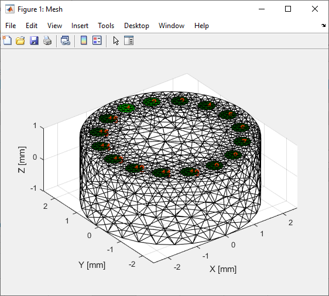
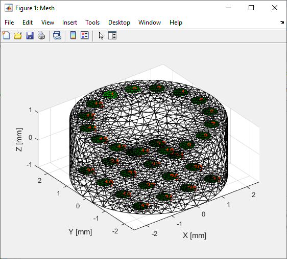
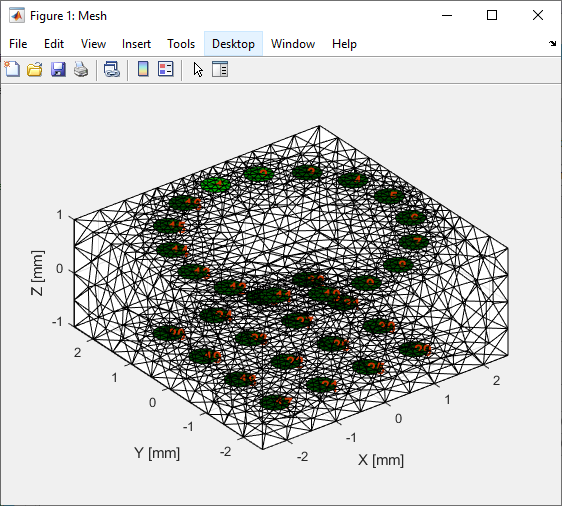
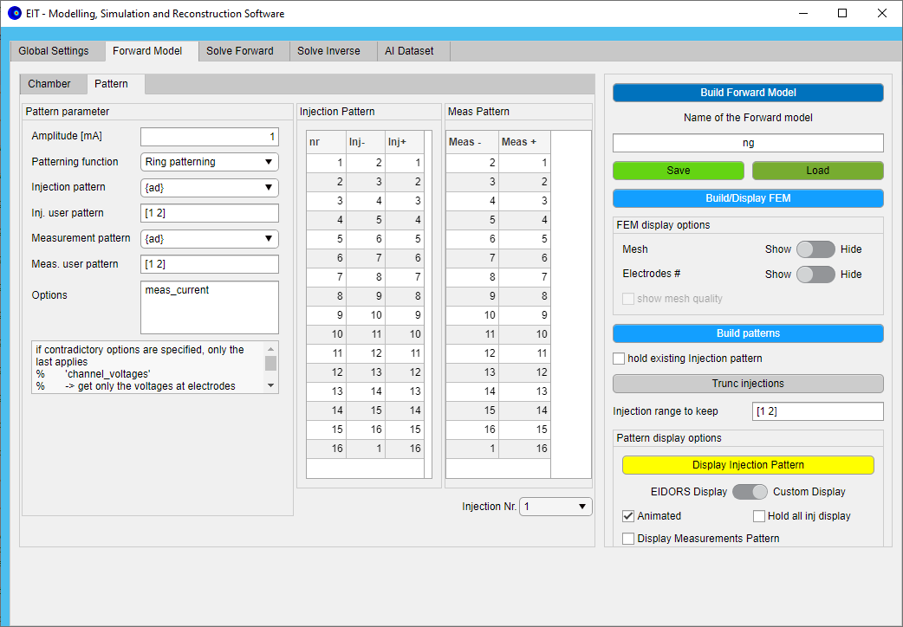

# **App_EIDORS_ModelSim**

Thank you for the interest in `App_EIDORS_ModelSim`!

`App_EIDORS_ModelSim` is a MATLAB-based, open-source framework for Modeling, 

Simulation and Reconstruction of Electrical Impedance Tomography (EIT) setup.

# **1. Introduction**

## **1.1 Depedencies**

This MATLAB-based app is based on the toolbox [EIDORS](http://eidors3d.sourceforge.net/)

You will need:

- Matlab (only R2021a tested)
- EIDORS ([eidors-v3.10-ng](http://prdownloads.sourceforge.net/eidors3d/eidors-v3.10-ng.zip))

## **1.2 Features**

This App allow a fast use of the EIDORS Toolbox

- [x]  Generation Forward model
    - [x]  Setting of the forward solver
    - [x]  Generation of measurement chamber: 2D (circle) and 3D (cylinder/cubic) using netgen
    - [x]  Generation of electrodes layout: ring and array (only for 3D on top or bottom surface)
    - [x]  Generation of injection and measurements pattern
- [x]  Simulation of measurements
    - [x]  Setting of the conductivity by adding objects (cells, sphere, cylinder) in the chamber
    - [x]  Solving of the forward problem
- [x]  Reconstruction of measurements
    - [x]  Setting of the inverse solver
    - [x]  Loading real measurement or use of simulation results for the reconstruction
    - [x]  Solving of the inverse problem
- [x]  Plotting
    - [x]  FEM mesh of the forward model
    - [x]  Pattern
    - [x]  Simulation results (FEM/ measurements Uplots)
- [x]  Generation of dataset for AI
    - [x]  Generation of Simulation of measurements
    - [x]  Samples data extraction for python-based AI computation

## **1.2 Installation**

This MATLAB-based framework is based on the toolbox [EIDORS](http://eidors3d.sourceforge.net/)

### **Windows**

Steps:

- Install MATLAB (only R2021a tested)
- Download EIDORS ([eidors-v3.10-ng](http://prdownloads.sourceforge.net/eidors3d/eidors-v3.10-ng.zip))  and save the `EIDORS`-folder on your local machine under `C:` suchas the `startup.m`-file is at the path: 'C:\EIDORS\eidors\startup.m (note: you can also put it somewhere else, in that case you will be asked after the first start of the app)
- Start the App (see 1.3 Starting the App in MATLAB)

### **Linux (Ubuntu 20.04.3 LTS 64-bit)**

Steps:

- Install MATLAB (only R2021a tested)
- Download EIDORS ([eidors-v3.10-ng](http://prdownloads.sourceforge.net/eidors3d/eidors-v3.10-ng.zip))  and save the `EIDORS`-folder on your local machine under `/usr/local/` suchas the `startup.m`-file is located at the path: '/usr/local/EIDORS/eidors/startup.m` (note: you can also put it somewhere else, in that case you will be asked after the first start of the app)
- Install netgen-5.3.1 (see documentation under doc/netgen_UNIX_installation), good luck 😉!!
- Start the App (see 1.3 Starting the App in MATLAB)

# **2. Starting the App in MATLAB**

During the start of the app EIDORS-Toolbox will be started (will be loaded in the MATLAB-PATH)

Run the script 'start.m' 

```matlab
>> cd Path\To\App_EIDORS_ModelSim
>> start 
```


here on the first page you can
- check the used EIDORS-toolbox path
- Choose the units you want to use
- Save/Load the eit environnement (eit_env) to save/load your work (the "export 2py" option allow to save additionaly the `eit_env` as which can be read by python (scipy) for the [`eit_app`](https://github.com/DavidMetzIMT/eit_app) and [`eit_ai`](https://github.com/DavidMetzIMT/eit_ai), see also "/file/mat_utils.py" in [`glob_utils`](https://github.com/DavidMetzIMT/glob_utils))

# **3. Classes**

The App uses the top level Classes for the differents tasks (modelling, simulation, reconstruction).
Here a brief overview of the structure of it with the main functionality and data:

## `EIT_env` 
is the top level object defining a environement for modelling simulation and reconstruction of EIT setup.
- `EIT_setup`, Setup of the measurement chamber, electrodes and injection/measurement pattern for building the forward model
    - `EIT_chamber`<br> all informations abour the chamber for meshing, etc. Different
        - name, User specific name for the chamber
        - boxSize, Dimension of the chamber in X, Y, Z
        - femRefinement, Refinement value for FEM mesh generation
        - form, Form of the Chamber: 'Cylinder', 'Cubic', '2D_Circ';"supported_forms"-method return the valid supported forms
    - `EIT_elec_layout`, all informations abour the electrodes for meshing, etc.
        - elecNb, number of electrodes
        - elecForm, form of the electrode Circular, Rectangular, Point
        - elecSize, width, height of the electrode
        - elecPlace, where in the chamber the electrodes are placed e.g.Wall, Top Bottom
        - layoutDesign, Design of the electrode layout, e.g. Ring, Grid
        - layoutSize, Design size (X, Y, Z)
        - zContact, Impedance contact of the electrodes
    - `EIT_pattern`, informations about the generation of injection and measurement patterns. Differrent Patterning function are available different pattern 
        - injAmplitude, amplitude of the injection current in A
        - injType, ad, op,....
        - injSpecial, some types need some special infos
        - measType, ad, op,....
        - measSpecial, some types need some special infos
        - patternOption, patterning function can accept some options
        - patternFunc, patterning function

- `Eidors_fmdl`, the forward model aslike in EIDORS (but as an Class)
        nodes                 
        elems                 
        boundary              
        boundary_numbers      
        gnd_node              
        np_fwd_solve          
        name                  
        electrode             
        solve                 
        jacobian              
        system_mat            
        mat_idx               
        normalize_measurements
        misc                  
        get_all_meas          
        stimulation           
        meas_select
- `Eidors_imdl`, the inverse model aslike in EIDORS
- `EIT_sim_env`, Simulation environmnent with EIDORS
- `EIT_rec_env`, Reconstruction environmnent with EIDORS

```matlab
classdef EIT_env < handle
    %EIT_ENV Enviromment used for the simulation reconstruction of EIT measurements using the EIDORS Toolbox
    
    properties
        name
        dir_path
        type='eit_env'
        setup EIT_setup % Regroup the data for the Measeuement setups (chamber electrode, pattern)
        fwd_model Eidors_fmdl % the forward model aslike in EIDORS
        inv_model Eidors_imdl % the inverse model aslike in EIDORS
        sim EIT_sim_env % Simulation env for simulation with EIDORS
        rec EIT_rec_env % Reconstruction environmnent with EIDORS
    end
...  

```
# **4 Use of the App**

The App is divided in 5 :
- Global Settings <br>
-> Save/Load EIT environement, Select units, ...
- Forward Model <br>
-> Define fwd solver, chamber, electrodes, patterns to build the Forward Model or fmdl
- Solve Forward <br>
-> Simulate measurements using the fmdl by setting some object in the chamber
- Solve Inverse <br>
-> EIT Image Reconstruction using the fmdl and Simualtions data or measurements data 
- AI Dataset <br>
-> Simulate measurements using the fmdl and ramdom generation of  to build a  dataset for AI training

## **4.1. Global Settings**


## **4.2. Forward Model**

The forward model can be in one click build. During that build the FEM and the patterns are generated using the data entries selected in the `Chamber` and the `Pattern`-tabs.

It is also possible to generate/ajust the FEM and the patterns manually. ATTENTION: 
the rebuild of the FEM will reset the patterns, so make sure to rebuild them afterwards.

The build Forward model can be saved and loaded back.

Mulptiple FEM and Pattren diplay options are valible to allow optimal investigations of those (see below).


Notes:
- Before building the forward model, make sure you set the units you need.

### **4.2.2 Chamber for FEM**

To Build the FEM the EIT Chamber, which is composed out of a body (volume, centered in (0,0,0)) and electrode layouts, need to be defined. The Fem will be computed with netgen.

Multiples bodies are available :
- 2D Circle
- 3D Cylinder (orirnted on the Z-axis)
- 3D Cubic

one of multiples layouts of electrodes can be used (see examples).

Compatible combination
|Layout|body|Layout Position|
|:---:|:---:|:---:|
|Ring|2D Circle| Wall|
|Ring|3D Cylinder| Wall|
|Ring|3D Cylinder| Top|
|Ring|3D Cylinder| Bottom|
|Ring|3D Cubic| Top|
|Ring|3D Cubic| Bottom|
|Array*|3D Cylinder| Top|
|Array*|3D Cylinder| Bottom|
|Array*|3D Cubic| Top|
|Array*|3D Cubic| Bottom|

by the combination |Ring|2D Circle Wall|/ |Ring|3D Cylinder| Wall| the diametre of the deigan wont be used.


the cahmber cna be separatel savedd and loaded 


multiple layouts of electrodes cabe be selected (see examples)

the


|Chamber example|FEM plot|
|:---:|:---:|
| **Circle_elec_ring_wall** |  |
|**Cylinder_elec_ring_wall**||
|**Cylinder_elec_ring_top**||
|**Cylinder_elec_ring_bot**||
|**Cylinder_elec_ring_top_array_bot**||
|**Cubic_elec_ring_top_array_bot**||

When 2D is selected, the electrode position should be always on wall.

### **4.2.3 Pattern**

To build the injection and measuremnet pattern select:
- the amplitude of the injection current
- the generating function (same for inj. and meas. patterning)
- the options of the generating function
- the injection pattern and ia the user pattern
- the measurements pattern and ia the user pattern


After a first build it is possible to append new patterns by selecting the hold options before rebuilding them

After building the patterns, the injections can be trunced by selecting the range of the injections to keep.




The injection pattern can be displayed using the EIDORS function "show_stim_meas_pattern" or a lightweight display custom function. Each measurements pattern can be displayed by selectioon the corresponding Injection Nr.

Example of patterning display

| Inj Pattern | Meas Pattern | EIDORS Display | Custom Display |
|:---:|:---:|:---:|:---:|
|ad | ad|  |  |
|op | op|||

## **4.3. Solve Forward**

Here the EIDORS solvers parameters can be selected.
To solve the Forward problem the conductivitsy of the Chamber has to be set.

The results of the that simulation can be expeot as mat-file containing

X, 
X_ih
X_h
eit_env

this resultsfil can be loaded as an eit_emnv file and the results of that simulation can be redisplayed of the soling can be run!


### **4.3.1 Forward solver**
see eidors documentation

### **4.3.2 Objects**

sphere

cell


cylinder


In the command line, with following command can directly access the variables of forward model.

```matlab

>> app.eit_env.fwd_model.fmdl()   % struct of forward model
>> app.eit_env.sim.img_h
>> app.eit_env.sim.img_ih         % homogeneous and inhomogeneous FEM image
>> app.eit_env.sim.data_h.meas
>> app.eit_env.sim.data_ih.meas   % homogeneous and inhomogeneous voltages 
```

## **3. Solving Inverse model**

After solving forward model,  Inverse model can be directly solved with selected solver.

When “Load meas” is chosen, the real measurements(homogeneous and inhomogeneous voltages) can be loaded and solved. Before loading the real measurement, a simulation of forward model is still essential.

In the command line, with following command can directly access the variables of forward model.

```matlab
>> app.eit_env.rec.iimg           % reconstructed image
>> app.eit_env.rec.data_h.meas
>> app.eit_env.rec.data_ih.meas   % homogeneous and inhomogeneous conductivity distribution
```

### 4. **Dataset for AI**

- define different parameters and save user_entry
- Generate Training samples with user_entry
- load eit_dataset.mat file after generation
- different samples can be plotted with “show scr_data”


After generation , four different files can be obtained.

1. “Samples” fold contains sample data (x and y)
2. “src_data” fold contains all information of samples
3. “eit_dataset.mat” is loaded to plot samples 
4.  “infos2py” is used for loading in python

### 5. Global

eit environment and a “info2py.mat” file can be saved.


## 3.1 Examples of Forward Model


#### 3.1.2 Examples of Forward Model

#### 3.1.3 Examples of Forward Model

### 3.2 Simulation / Forward Solving (2D/3D)
#### 3.2.2 Example of simulation
#### 3.2.1 Object definition

### 3.2 Reconstruction / Inverse Solving (2D/3D)

### 3.3 Generation of AI
#### 3.3.1 Example of dataset generation
#### 3.3.2 

## 4. Cite our work.

**If you find `app_eidors_modelsim` useful, please cite our work!**


